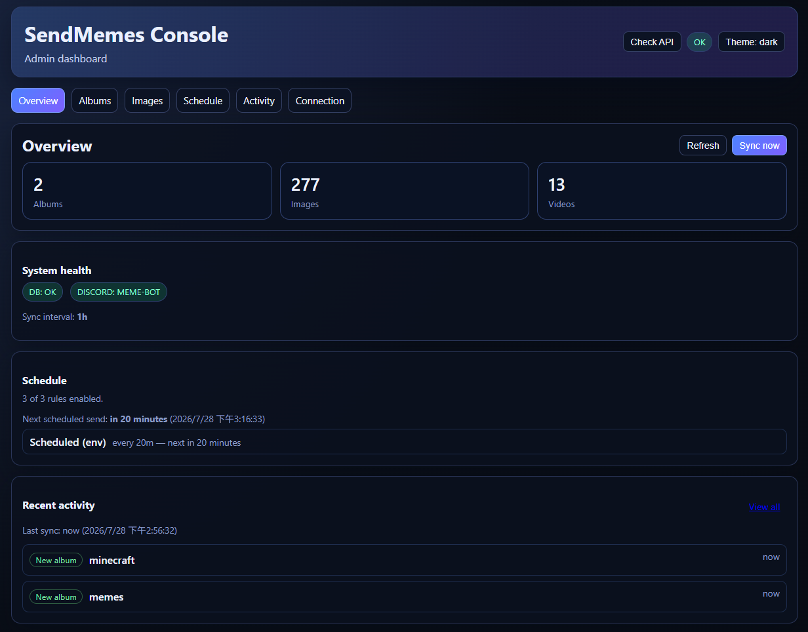
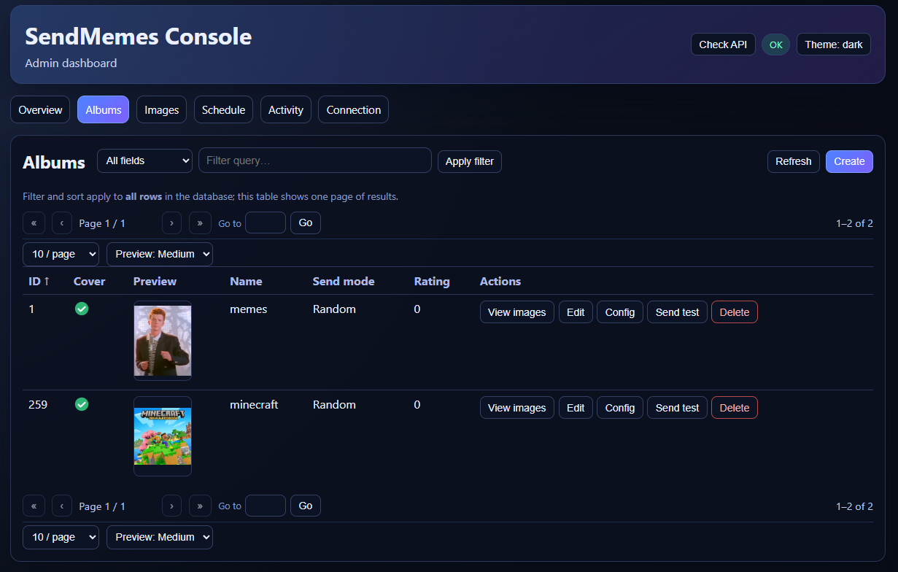
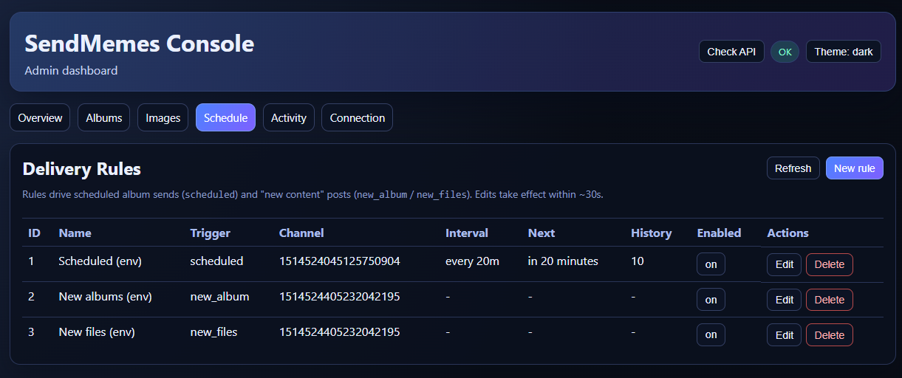
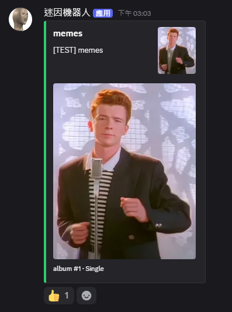

# sendmemes-discord-bot

[](go.mod)
[](https://github.com/AaronCheng1996/sendmemes-discord-bot/actions/workflows/ci.yml)
[](LICENSE)

A self-hostable Discord bot that periodically posts albums of memes to a
channel, complete with a Vue admin dashboard for managing albums, delivery
rules, and sync status.

## Highlights

- **No cloud account required** — point it at a local folder
  (`MEDIA_SOURCE=local`) or a pCloud account; either way, `docker compose up`
  gets you a running bot + dashboard.
- **Configurable delivery** — per-album send modes (random batch, ordered
  comic, single image, video, or a fully custom batch shape), scheduled or
  event-triggered delivery rules, per-rule caption templates, rich Discord
  embeds.
- **Admin dashboard** — an Overview page with live system status, plus
  CRUD screens for albums, images, delivery rules, and a sync activity feed.
- **Engagement built in** — reaction-based album ratings, an auto 👍 on every
  post, and a `/album_stats` leaderboard.

## Screenshots

**Overview dashboard**



**Albums**



**Delivery rules**



**Discord post**



## Quickstart

1. Create a Discord application + bot at the
   [Discord Developer Portal](https://discord.com/developers/applications),
   invite it to your server (`bot` + `applications.commands` scopes; grant
   Send Messages, Attach Files, Add Reactions, and Create Public Threads),
   and copy its token.
2. `cp .env.example .env` and fill in three variables: `DISCORD_TOKEN`,
   `ADMIN_API_KEY` (any string — gates the admin API and dashboard sign-in),
   and `MEDIA_SOURCE=local` (no cloud account needed — drop meme folders into
   `./media/<album name>/<file>` and uncomment the `./media:/media` volume
   under the `app` service in `docker-compose.yml`).
3. `git submodule update --init --recursive && docker compose up -d --build`
4. Open `http://localhost:8081` and sign in with `ADMIN_API_KEY`.

See [Running locally](#running-locally) below for the pCloud-backed path and
other options.

## Features

### Discord side

- **Delivery rules** — a configurable list (`delivery_rules`) drives all
  Discord posting. Each rule has a `trigger_type`:
  - `scheduled` — every `send_interval`, deliver a random album to the rule's
    channel (anti-repeat via `history_size` + `last_sent_at`; the exclusion
    window resets once every album has cycled through).
  - `new_album` / `new_files` — when a pCloud sync discovers a new album, or
    new files in an existing album, post the new media to the rule's channel.

  Rules are managed from the admin UI or the `/schedule` slash/prefix command
  (`list` / `add` / `remove`). A scheduled goroutine per rule is reconciled
  from the DB every ~30s, so edits take effect without a restart. Env
  (`DISCORD_CHANNEL_ID`, `DISCORD_NOTIFY_CHANNEL_ID`) seeds default rules once
  when the table is empty.
- **Typed delivery** — each album's `send_mode` controls the message format:
  `Random` (size-fitted batch of images), `Order` (comic pages in natural
  filename order; first batch only — `/full_album` posts the rest in a thread),
  `Single` (one image),
  `Video` (one random video — uploaded as an attachment when ≤ 10 MB,
  otherwise posted as a permanent pCloud public link),
  `Custom` (batch built from the album's `send_config_json`: `batch_size`,
  `include_cover`, `ordered`, `caption`, `nsfw` — see the Config button on the
  Albums page). `caption` and `nsfw` (spoiler-tagged attachments) apply to
  every mode, not just `Custom`. Set the mode from the admin UI or the
  `/album_mode` slash command.
- **Rich sync notifications** — `new_album` / `new_files` rules post the actual
  discovered media: new images merged into one size-fitted message (up to 10),
  new videos as permanent pCloud public links. The first-ever import is suppressed to
  avoid flooding, and every discovery is also stored for the Activity page.
- **Reaction feedback** — any non-bot reaction on a scheduled message
  increments the album's `positive_rating` (in-memory map of the latest 200
  message → album mappings). The bot auto-adds a 👍 to its own posts so the
  mechanic is discoverable; `/album_stats` lists the top 10 albums by rating.
- **Media sync** — periodically walks the configured media source (pCloud or
  a local directory, see below) and reconciles albums, images, and videos
  (file sizes included). The cadence is runtime-configurable
  (`app_settings.sync_interval`, seeded from `PCLOUD_SYNC_INTERVAL`) and can
  be triggered on demand. pCloud download URLs are short-lived, so the bot
  resolves them on demand and caches them in memory (~50 min TTL) to keep
  pCloud API usage low; local files have no such expiry.

### When a source folder disappears

Deleting (or emptying) a folder does not silently delete the album. The next
sync flags it with `missing_since` and the dashboard shows a **missing** badge:

- The album keeps its `positive_rating`, send mode and config, so nothing is
  lost if the folder was only moved away temporarily.
- Missing albums are skipped by scheduled delivery, so the channel stops
  receiving failed sends for files that no longer exist.
- If the folder comes back, the next sync clears the flag automatically.
- To remove it for good, delete the album from the Albums page; its image rows
  are cascaded away with it.

As a safety net, a sync that finds **no media at all** skips this pass entirely
and logs a warning — that almost always means a broken source, a wrong root ID
or expired credentials rather than an intentionally emptied library.

### Customizing messages

Three layers shape a post, each overriding the one below it **per field**:

| Layer | Where | Sets |
|---|---|---|
| App defaults | Connection page → Message defaults | format, title, body |
| Delivery rule | Schedule page → rule form | format, title, body |
| Album | Albums page → **Config** button (`send_config_json`) | format, title, body |

Because merging is per field, layers combine rather than replace each other —
e.g. plain text by default, one rule that switches to embeds and sets a shared
title, and an album under it that supplies only its own body (inheriting that
rule's title and embed setting).

**Format** — every layer can force embeds on or off (`use_embed`); rules and
albums may also leave it unset to inherit. **Title and body apply either way**:
in embed mode they become the embed title and description, in plain mode a bold
first line and the message text.

An empty title falls back to the album name (embed) or is omitted (plain); an
empty body falls back to the built-in caption.

**Embed options** — when the resolved format is an embed, each layer can also set
`color` (`#rrggbb`), `footer`, `author`, `url` (makes the title a link), and the
`show_image` / `show_thumbnail` / `show_timestamp` toggles. Footer and author
accept the same placeholders. These are ignored in plain-text mode.

Use the **Test** button on the Schedule page to preview exactly what a rule
produces — including `new_album` / `new_files` rules, which otherwise only fire
when a sync finds something.

#### Placeholders

Title and body share one placeholder set:

| Placeholder | Replaced with |
|---|---|
| `{album}` | Album name |
| `{album_id}` | Album id |
| `{mode}` | The album's send mode |
| `{count}` | Number of files in this message |
| `{total}` | Number of files that were available |
| `{rating}` | The album's `positive_rating` |
| `{new_images}` / `{new_videos}` / `{new_total}` | Discovery notifications: what this sync found |
| `{prefix}` | `[TEST] ` for admin test sends, empty for scheduled posts |
| `{date}` / `{time}` | Current date (`2006-01-02`) / time (`15:04`) |

`{prefix}` exists so test sends stay recognizable. The default caption puts it
in front of the album name, so a custom template that leaves it out makes
"Send test" posts look exactly like real ones — keep it first if you want the
marker:

```text
{prefix}📢 {album} — {count}/{total} pics · ⭐ {rating}
```

#### Per-album overrides (`send_config_json`)

Each album carries an optional JSON config, edited with the **Config** button on
the Albums page. Every key is optional; `{}` (or empty) means "use the
defaults".

| Key | Type | Effect | Applies to |
|---|---|---|---|
| `caption` | string | Message body for this album (placeholders above still work) | all modes |
| `title` | string | Headline for this album | all modes |
| `use_embed` | bool | Force embed (`true`) or plain text (`false`); omit to inherit | all modes |
| `nsfw` | bool | Prefixes attachment filenames with `SPOILER_`, so Discord blurs them | all modes |
| `batch_size` | int | Images per message | `Random`, `Custom` (`Single` sends one by definition) |
| `ordered` | bool | Natural filename order instead of random | `Custom` |
| `include_cover` | bool | `false` drops the cover from the batch | `Custom` |

Send a few more images from one album, leaving everything else alone:

```json
{ "batch_size": 5 }
```

Blur an adult album and give it its own caption:

```json
{ "nsfw": true, "caption": "⚠️ NSFW — {album}" }
```

Give one album its own headline and drop back to a plain message, inheriting
everything else:

```json
{ "title": "📌 Pinned pick", "use_embed": false }
```

Post a fixed, cover-less run of pages in filename order:

```json
{ "ordered": true, "include_cover": false, "batch_size": 8 }
```

`ordered` and `include_cover` are only read by the `Custom` send mode, so switch
the album to `Custom` when you need them; `caption`, `nsfw` and `batch_size`
apply in every mode. An album's `caption` takes precedence over the rule's
`caption_template`.

### Media sources

`MEDIA_SOURCE` selects where the bot syncs media from:

- `pcloud` (default) — walks the pCloud folder IDs in `CLOUD_MAIN_FOLDER_ID`.
  Needs `PCLOUD_ACCESS_TOKEN` or `PCLOUD_USERNAME`/`PCLOUD_PASSWORD`.
- `local` — walks `MEDIA_LOCAL_ROOT`, a directory laid out as
  `<album name>/<file>` (nesting under an album folder is fine; files placed
  directly under the root, with no album folder, are skipped). No account
  needed — just mount a folder (`./media:/media` in `docker-compose.yml`) and
  set `MEDIA_SOURCE=local`. Files are served back to Discord/the dashboard via
  a read-only `GET /media/*` route (see below), so `HTTP_PUBLIC_URL` must be
  reachable from wherever the bot's HTTP server is exposed.

### Admin REST API (`/v1/admin/*`, gated by `X-Admin-Key`)

- Albums CRUD (`/albums`) — including per-album `send_mode` (delivery type)
  and `send_config_json` (Custom mode overrides)
- Images CRUD (`/images`, optional `album_id` scope; rows carry `kind` and
  `size_bytes`)
- Delivery rules CRUD (`/delivery-rules`) — including per-rule
  `caption_template`
- Sync settings read/update (`/sync-settings`) and manual sync
  (`/sync/trigger-now`)
- Manual scheduled send (`/schedule/trigger-now`) and per-album test send
  (`/albums/:id/send-test`) — both take an optional `channel_id`, falling back
  to the first enabled scheduled rule, and both run as background jobs
  (`GET /jobs`)
- Sync activity feed (`/sync-events`) — paginated discovery events for the
  dashboard Activity page
- Aggregated system status (DB ping + Discord session + sync interval + rule
  count + next scheduled run + last sync time + album/image/video counts) at
  `/system/status`
- Audit trail in `admin_audit_logs` (actor from `X-Admin-Actor`, otherwise
  `api_key`)

List endpoints return a paginated envelope and embed a resolved
`preview_url` per row so the dashboard can render thumbnails without extra
round-trips. Album previews use a pCloud `getpubthumb` thumbnail derived from
the file's permanent public share link, so they load from any browser; image
rows still use temporary `getfilelink` URLs, which are bound to the bot
container's IP:

```json
{ "items": [...], "total": 0, "offset": 0, "limit": 50 }
```

### Other endpoints

- `GET /healthz` — liveness probe
- `GET /metrics` — Prometheus, when `METRICS_ENABLED=true`
- `GET /media/*` — serves files under `MEDIA_LOCAL_ROOT`, only registered
  when `MEDIA_SOURCE=local`; not behind `X-Admin-Key` since Discord's CDN and
  the dashboard both need to fetch it anonymously

## Configuration

All configuration is driven by environment variables (see `.env.example`,
grouped into required/optional blocks).

Highlights:

| Variable | Purpose |
|---|---|
| `HTTP_PORT`, `HTTP_PUBLIC_URL` | HTTP server bind/port and external base URL used in resolved preview URLs |
| `POSTGRES_*` / `PG_URL` | PostgreSQL connection (PG_URL takes precedence) |
| `ADMIN_API_KEY` | Required for every `/v1/admin/*` request and for the UI sign-in |
| `DISCORD_TOKEN`, `DISCORD_APPLICATION_ID`, `DISCORD_GUILD_ID` | Discord bot identity |
| `DISCORD_CHANNEL_ID`, `DISCORD_SEND_INTERVAL`, `DISCORD_SEND_HISTORY_SIZE` | Seed the default **scheduled** delivery rule (once, when `delivery_rules` is empty) |
| `DISCORD_NOTIFY_CHANNEL_ID` | Seeds default **new_album** + **new_files** rules (once, when `delivery_rules` is empty; empty = no notify rules) |
| `ALBUM_DEFAULT_SEND_MODE` | Default `send_mode` for albums created by sync and admin creates that omit one (`Order`/`Random`/`Single`/`Video`/`Custom`, default `Random`) |
| `MEDIA_SOURCE` | `pcloud` (default) or `local` — see [Media sources](#media-sources) |
| `MEDIA_LOCAL_ROOT` | Directory walked/served when `MEDIA_SOURCE=local` (default `/media`) |
| `PCLOUD_ACCESS_TOKEN` *or* `PCLOUD_USERNAME` + `PCLOUD_PASSWORD` | pCloud authentication (only when `MEDIA_SOURCE=pcloud`). `PCLOUD_TOKEN_TYPE=session` (default, sent as `auth=`) or `oauth` (sent as `access_token=`); pCloud's API does not support 2FA |
| `CLOUD_MAIN_FOLDER_ID` | Comma-separated pCloud folder IDs holding album subfolders |
| `PCLOUD_API_ENDPOINT` | `https://api.pcloud.com` (US) or `https://eapi.pcloud.com` (EU) |
| `PCLOUD_SYNC_INTERVAL` | Seeds `app_settings.sync_interval` (once); afterwards editable at runtime from the Connection page |
| `METRICS_ENABLED` | Toggle the Prometheus metrics handler |

## Running locally

The repository ships with a Docker Compose stack that runs PostgreSQL, the
bot, the admin dashboard, and an Nginx reverse proxy — one command gets the
full stack:

```sh
git submodule update --init --recursive
cp .env.example .env
# Fill in DISCORD_*, ADMIN_API_KEY, and either PCLOUD_* or MEDIA_SOURCE=local
# (+ ./media:/media in docker-compose.yml, see Media sources above) in .env
docker compose up -d --build
docker compose logs -f app
```

The bot's API is at `http://localhost:8080` and the dashboard at
`http://localhost:8081` (sign in with `ADMIN_API_KEY`); `*.lvh.me` publicly
resolves to `127.0.0.1`, so Nginx's `http://app.lvh.me` route also works
with no `/etc/hosts` changes.

To run just the database and the Go binary on the host (good for debugging):

```sh
make compose-up   # postgres only
make run          # builds with the migrate tag and runs cmd/app
```

The bot runs database migrations automatically when built with the `migrate`
build tag (already enabled in the Dockerfile and `make run`).

`docker-compose.external-db.yml` is an alternate compose file for deploying
against an already-running external Postgres + reverse-proxy network (the
author's own homelab layout) instead of the self-contained stack above; most
people should stick with the default `docker-compose.yml`.

## Database migrations

`migrations/` holds incremental, ordered SQL files
(`00000N_<name>.{up,down}.sql`); `000001_init` is the baseline schema and
later files layer on top of it. They apply automatically when the bot is
built with the `migrate` build tag (the default in the Dockerfile and
`make run`). To reset a dev database from scratch:

```sh
make db-reset       # drops everything, reapplies every migration in order
```

Add new schema changes as a new migration file
(`make migrate-create name=<title>`) — existing, already-applied migrations
are never edited once the project has real data.

## Admin UI (frontend)

The Vue 3 dashboard lives in the `ui/` submodule. `docker compose up` already
builds and serves it (see Running locally above); for hot-reload development
instead, run it directly from the repo root (see `ui/README.md` for more):

```sh
cd ui
npm install
npm run dev   # http://localhost:5173 by default
```

Sign in with the `ADMIN_API_KEY` you set in `.env`. The key is held only in
the browser's `sessionStorage`.

## Development workflow

| Task | Command |
|---|---|
| Format Go code | `make format` |
| Lint | `make linter-golangci` |
| Unit tests | `make test` |
| Regenerate mocks | `make mock` |
| Pre-commit bundle | `make pre-commit` |

## Project layout

The repository started from a Go Clean Architecture template, so the layout
keeps that structure:

```
cmd/app                 # main entry point
config                  # env-driven config
internal/app            # wiring (Run) and migration init (build tag: migrate)
internal/controller
    restapi             # Fiber HTTP router, middleware, v1 handlers
    discord             # discordgo bot, scheduler, command handlers
internal/usecase        # business logic (admin, images, sync, rules, appsettings, ...)
internal/repo
    persistent          # PostgreSQL implementations
    webapi              # external APIs (pCloud)
    localfs             # local filesystem MediaSource (MEDIA_SOURCE=local)
internal/entity         # domain types
migrations              # incremental SQL migrations
pkg/{httpserver,logger,postgres}
sample                  # default fallback image (embedded)
ui                      # Vue 3 admin dashboard (git submodule)
```

## Roadmap / known follow-ups

- Weighted album selection that biases toward higher `positive_rating`
  (`ORDER BY RANDOM() * (1 + positive_rating) DESC`).
- Move in-code tunables (`albumBatchSize`, `reactMapMaxSize`,
  `downloadTimeout`, `videoUploadLimit`, `maxSyncNotifyMessages`,
  `scheduleReconcileInterval`) to env when deployments need to differ.
- Push scheduled-rule reconciliation on rule change instead of the ~30s poll.
- Anti-repeat `last_sent_at` is global; consider per-rule send history if
  multiple scheduled rules should not share exclusion state.
- Replace the `*` CORS allow-list with an explicit dashboard origin once a
  hosted UI URL is decided.
- Audit-log retention / API surface (currently write-only).

## License

MIT — see `LICENSE`.
